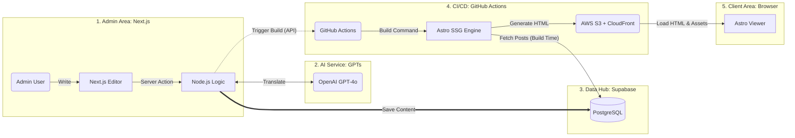

# System Architecture

## Overview

## Flow

1. **콘텐츠 작성**: Admin이 Next.js Editor에서 글 작성 → Server Action → Supabase에 저장
2. **AI 번역**: 저장 시 OpenAI GPT-4o를 통해 다국어 번역 처리
3. **빌드 트리거**: Node.js Logic이 GitHub Actions에 빌드 트리거 API 호출
4. **SSG 빌드**: Astro가 빌드 타임에 Supabase에서 전체 포스트 Fetch → 정적 HTML 생성
5. **배포**: 생성된 HTML을 AWS S3에 업로드, CloudFront CDN으로 서빙
6. **사용자 접근**: 브라우저에서 정적 HTML 로드 (JS 최소화)

## App별 역할

| App           | Framework               | 역할                      | 렌더링                                      |
| ------------- | ----------------------- | ------------------------- | ------------------------------------------- |
| `apps/admin`  | Next.js 15 (App Router) | 글 작성/편집, 빌드 트리거 | CSR (Server Action/API Route for 서버 로직) |
| `apps/client` | Astro 5                 | 공개 블로그 뷰어          | SSG                                         |

## 외부 서비스

| 서비스                | 용도              |
| --------------------- | ----------------- |
| Supabase (PostgreSQL) | 콘텐츠 DB         |
| OpenAI GPT-4o         | 다국어 번역       |
| GitHub Actions        | CI/CD, SSG 빌드   |
| AWS S3 + CloudFront   | 정적 호스팅 + CDN |
