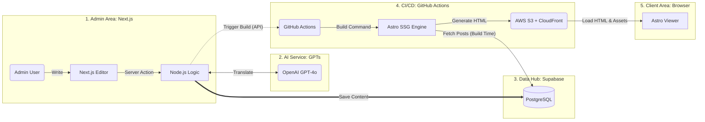

# System Architecture

## Overview



## Flow

1. **콘텐츠 작성**: Admin이 Next.js Editor에서 글 작성 → Server Action → Supabase에 저장
2. **AI 번역**: 저장 시 OpenAI GPT-4o를 통해 다국어 번역 처리
3. **빌드 트리거**: Node.js Logic이 GitHub Actions에 빌드 트리거 API 호출
4. **SSG 빌드**: Astro가 빌드 타임에 Supabase에서 전체 포스트 Fetch → 정적 HTML 생성
5. **배포**: 생성된 HTML을 AWS S3에 업로드, CloudFront CDN으로 서빙
6. **사용자 접근**: 브라우저에서 정적 HTML 로드 (JS 최소화)

## App별 역할

| App           | Framework               | 역할                      | 렌더링                                      |
| ------------- | ----------------------- | ------------------------- | ------------------------------------------- |
| `apps/admin`  | Next.js 15 (App Router) | 글 작성/편집, 빌드 트리거 | CSR (Server Action/API Route for 서버 로직) |
| `apps/client` | Astro 5                 | 공개 블로그 뷰어          | SSG                                         |

## 외부 서비스

| 서비스                | 용도              |
| --------------------- | ----------------- |
| Supabase (PostgreSQL) | 콘텐츠 DB         |
| OpenAI GPT-4o         | 다국어 번역       |
| GitHub Actions        | CI/CD, SSG 빌드   |
| AWS S3 + CloudFront   | 정적 호스팅 + CDN |

## Client App Directory Structure (`apps/client`)

```
src/
├── features/
│   ├── post-feed/                          # 카드 피드 (카테고리/서브카테고리 리스트)
│   │   ├── components/
│   │   │   ├── PostCard.astro              # 단일 포스트 카드
│   │   │   ├── PostCardGrid.astro          # 카드 그리드 + InFeedAdsense + 페이지네이션
│   │   │   └── SponsoredCard.astro         # 협찬 포스트 카드
│   │   ├── api/
│   │   │   ├── posts.ts                    # 포스트 데이터 fetch (빌드 타임)
│   │   │   └── translations.ts             # 번역 데이터 fetch (빌드 타임)
│   │   └── mock/
│   │       ├── posts.ts                    # mock 포스트 데이터
│   │       └── translations.ts             # mock 번역 데이터
│   ├── post-detail/                        # 포스트 상세 페이지
│   │   ├── components/
│   │   │   ├── PlaceInfoCard.astro         # 장소 정보 카드 (Schema.org LocalBusiness)
│   │   │   ├── NearbyPostList.astro        # 같은 서브카테고리 인근 포스트 목록
│   │   │   └── PostBadges.astro            # 협찬/추천 뱃지 조합
│   │   └── lib/
│   │       ├── ads.ts                      # insertInArticleAds() — H2 섹션 경계 광고 삽입
│   │       └── schema.ts                   # buildBlogPostingSchema(), buildReviewSchema() JSON-LD
│   └── search/                             # 검색 기능
│       ├── components/
│       │   └── SearchUI.astro              # 검색 폼 + 추천 키워드 + 결과 리스트 + 클라이언트 스크립트
│       └── api/
│           └── search-data.ts              # buildSearchData() — 검색용 JSON 데이터 변환
├── shared/
│   ├── components/
│   │   ├── ad/
│   │   │   ├── FixedAdsense.astro          # 고정 위치 광고 (variant: 'post-top' | 'sidebar')
│   │   │   └── InFeedAdsense.astro         # 인피드 광고 (class? prop)
│   │   ├── layout/
│   │   │   ├── Header.astro                # 반응형 헤더 (PC/Mobile CSS 토글)
│   │   │   ├── PCHeader.astro              # PC 헤더 (LanguageSelector + getActiveSegments)
│   │   │   ├── MobileHeader.astro          # 모바일 헤더 (snap scroll nav)
│   │   │   ├── Footer.astro                # 푸터 (SEO 링크)
│   │   │   ├── LeftSidebar.astro           # 좌측 사이드바 (CategoryTree 포함)
│   │   │   ├── RightSidebar.astro          # 우측 사이드바 (FixedAdsense + SponsoredPostList)
│   │   │   ├── ThreeColumnLayout.astro     # 3-Column 그리드 레이아웃
│   │   │   ├── SponsoredPostList.astro     # 협찬 포스트 리스트
│   │   │   ├── SponsoredPostItem.astro     # 협찬 포스트 단일 아이템
│   │   │   └── BaseHead.astro              # <head> 메타/SEO 공통 요소
│   │   ├── navigation/
│   │   │   ├── CategoryTree.astro          # 카테고리 트리 (getActiveSegments)
│   │   │   ├── Breadcrumb.astro            # 브레드크럼 네비게이션
│   │   │   ├── SubCategoryTabs.astro       # 모바일 서브카테고리 탭
│   │   │   └── LanguageSelector.astro      # details/summary 언어 선택 드롭다운
│   │   ├── seo/
│   │   │   ├── JsonLd.astro                # JSON-LD 공통 래퍼
│   │   │   ├── BlogPostingJsonLd.astro     # BlogPosting 스키마
│   │   │   ├── BreadcrumbJsonLd.astro      # BreadcrumbList 스키마
│   │   │   ├── OpenGraph.astro             # Open Graph 메타 태그
│   │   │   └── Hreflang.astro              # hreflang 대체 링크
│   │   └── ui/
│   │       ├── StarRating.astro            # 별점 SVG (Schema.org Rating 포함)
│   │       └── SponsoredBadge.astro        # 협찬 라벨 뱃지
│   ├── lib/
│   │   ├── date.ts                         # formatDate(dateStr, locale)
│   │   ├── navigation.ts                   # getActiveSegments(pathname, locale)
│   │   └── i18n/
│   │       ├── locales.ts                  # locale 설정, getLocalePath()
│   │       ├── categories.ts               # getCategoryLabel()
│   │       └── translations.ts             # t() 번역 함수
│   └── types/
│       ├── category.ts                     # CategorySlug, CATEGORY_SLUGS
│       ├── common.ts                       # Locale, LOCALES, DEFAULT_LOCALE
│       ├── post.ts                         # LocalizedPost
│       └── seo.ts                          # BlogPostingSchema, ReviewSchema
├── layouts/
│   ├── Layout.astro                        # 루트 레이아웃
│   ├── ListLayout.astro                    # 리스트 페이지 레이아웃 (3-Column)
│   └── PostLayout.astro                    # 포스트 상세 레이아웃
├── pages/                                  # Astro 파일 라우팅
└── styles/                                 # 글로벌 스타일
```

## Search Architecture

- **데이터 전략**: 빌드 타임에 전체 포스트를 JSON으로 직렬화하여 검색 페이지 HTML에 인라인 삽입
- **검색 실행**: 클라이언트 JavaScript가 JSON을 파싱하여 title, description, place_name 기준으로 필터링
- **DB 의존성 없음**: 런타임 DB 쿼리 없이 완전한 정적 페이지로 동작
- **라우팅**: `/search/` (한국어), `/{locale}/search/` (다국어)
- **Header**: PC/Mobile 헤더 모두 순수 HTML/CSS — JavaScript 없음 (검색 버튼은 `/search/`로의 `<a>` 링크)

## 공유 패키지

| 패키지                 | 역할                                                          |
| ---------------------- | ------------------------------------------------------------- |
| `packages/tsconfig`    | 공유 TypeScript 설정 (base, nextjs, astro)                    |
| `packages/eslint-config` | 공유 ESLint Flat Config                                     |
| `packages/config`      | 공유 Tailwind 테마 (`theme.css` — 컬러 팔레트, 시맨틱 토큰)  |
