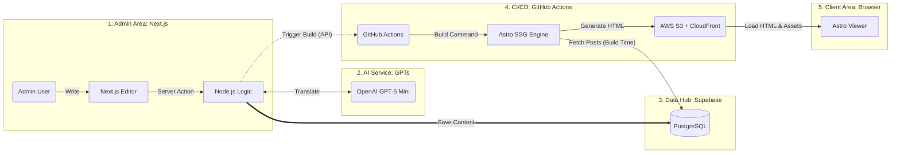

# System Architecture

## Overview


```mermaid
graph LR
    %% 1. 관리자 영역 (Admin & Logic)
    subgraph Group_Admin [1. Admin Area: Next.js]
        direction TB
        Admin(Admin User) -->|Write| Editor[Next.js Editor]
        Editor -->|Server Action| Logic[Node.js Logic]
    end

    %% 2. AI 서비스
    subgraph Group_AI [2. AI Service: GPTs]
        Logic <-->|Translate| OpenAI(OpenAI GPT-5 Mini)
    end

    %% 3. 데이터베이스 (Content Store)
    subgraph Group_DB [3. Data Hub: Supabase]
        DB[(PostgreSQL)]
    end

    %% 4. 배포 파이프라인 (Build System)
    subgraph Group_DevOps [4. CI/CD: GitHub Actions]
        direction TB
        GHA(GitHub Actions) -->|Build Command| AstroBuilder[Astro SSG Engine]
        AstroBuilder -->|Generate HTML| CF(AWS S3 + CloudFront)
    end

    %% 5. 사용자 영역 (User Actor 제외 / 뷰어 유지)
    subgraph Group_Client [5. Client Area: Browser]
        CF -->|Load HTML & Assets| Browser[Astro Viewer]
    end

    %% --- Critical Flows (데이터 및 트리거 흐름) ---

    %% A. 콘텐츠 저장 흐름
    Logic == "Save Content" ==> DB

    %% B. 빌드 트리거 흐름 (Webhook)
    Logic -.->|"Trigger Build (API)"| GHA

    %% C. 빌드 시 콘텐츠 조회 (SSG)
    AstroBuilder -- "Fetch Posts (Build Time)" --> DB
```

## Flow

1. **콘텐츠 작성**: Admin이 Next.js Editor에서 글 작성 → Server Action → Supabase에 저장
2. **AI 번역**: 저장 시 OpenAI GPT-5 Mini를 통해 다국어 번역 처리 (`is_multilingual === true`인 포스트만)
3. **빌드 트리거**: Node.js Logic이 GitHub Actions에 빌드 트리거 API 호출
4. **SSG 빌드**: Astro가 빌드 타임에 Supabase에서 전체 포스트 Fetch → 정적 HTML 생성. 다국어 경로 조건부 생성: 포스트 상세는 `is_multilingual === true`인 포스트만, 카테고리/서브카테고리 인덱스는 해당 분류에 multilingual 포스트가 1개 이상 존재할 때만 locale 경로를 생성 (thin content 방지)
5. **배포**: 생성된 HTML을 AWS S3에 업로드, CloudFront CDN으로 서빙. CloudFront Function(Viewer Request)이 `/path/` → `/path/index.html` 매핑을 처리.
6. **사용자 접근**: 브라우저에서 정적 HTML 로드 (JS 최소화)

## App별 역할

| App           | Framework               | 역할                      | 렌더링                                                      |
| ------------- | ----------------------- | ------------------------- | ----------------------------------------------------------- |
| `apps/admin`  | Next.js 15 (App Router) | 글 작성/편집, 빌드 트리거 | CSR (Server Action for 서버 로직, GPT는 브라우저 직접 호출) |
| `apps/client` | Astro 5                 | 공개 블로그 뷰어          | SSG                                                         |

## 외부 서비스

| 서비스                | 용도              |
| --------------------- | ----------------- |
| Supabase (PostgreSQL) | 콘텐츠 DB         |
| OpenAI GPT-5 Mini     | 다국어 번역       |
| GitHub Actions        | CI/CD, SSG 빌드   |
| AWS S3 + CloudFront   | 정적 호스팅 + CDN |

## Client App Directory Structure (`apps/client`)

```
src/
├── features/
│   ├── post-feed/                          # 카드 피드 (카테고리/서브카테고리 리스트)
│   │   ├── components/
│   │   │   ├── PostCard.astro              # 단일 포스트 카드
│   │   │   ├── PostCardGrid.astro          # 카드 그리드 + InFeedAdsense + 페이지네이션
│   │   │   └── SponsoredCard.astro         # 협찬 포스트 카드
│   │   ├── api/
│   │   │   ├── posts.ts                    # 포스트 데이터 fetch (빌드 타임, Supabase)
│   │   │   ├── translations.ts             # 번역 데이터 fetch (빌드 타임, Supabase)
│   │   │   └── categories.ts              # 카테고리 데이터 fetch (빌드 타임, Supabase categories 테이블)
│   │   └── mock/                            # (레거시 — 현재 미사용, Supabase 직접 연동)
│   ├── post-detail/                        # 포스트 상세 페이지
│   │   ├── components/
│   │   │   ├── PlaceInfoCard.astro         # 장소 정보 카드 (Schema.org LocalBusiness)
│   │   │   ├── NearbyPostList.astro        # 같은 서브카테고리 인근 포스트 목록
│   │   │   └── PostBadges.astro            # 협찬/추천 뱃지 조합
│   │   └── lib/
│   │       ├── ads.ts                      # insertInArticleAds() — H2 섹션 경계 광고 삽입
│   │       └── schema.ts                   # buildBlogPostingSchema(), buildReviewSchema() JSON-LD
│   ├── search/                             # 검색 기능
│   │   ├── components/
│   │   │   └── SearchUI.astro              # 검색 폼 + 추천 키워드 + 결과 리스트 + 클라이언트 스크립트
│   │   └── api/
│   │       └── search-data.ts              # buildSearchData() — 검색용 JSON 데이터 변환
│   └── consent/                            # 쿠키 동의 배너 (GDPR/APPI/PIPL/PDPA)
│       └── components/
│           └── CookieConsentBanner.astro   # Sticky Footer 배너 (en/ja/zh-CN/th locale만 렌더링)
├── shared/
│   ├── components/
│   │   ├── ad/
│   │   │   ├── FixedAdsense.astro          # 고정 위치 광고 (variant: 'post-top' | 'sidebar')
│   │   │   └── InFeedAdsense.astro         # 인피드 광고 (class? prop)
│   │   ├── layout/
│   │   │   ├── Header.astro                # 반응형 헤더 (PC/Mobile CSS 토글)
│   │   │   ├── PCHeader.astro              # PC 헤더 (LanguageSelector + getActiveSegments)
│   │   │   ├── MobileHeader.astro          # 모바일 헤더 (snap scroll nav)
│   │   │   ├── Footer.astro                # 푸터 (SEO 링크)
│   │   │   ├── LeftSidebar.astro           # 좌측 사이드바 (CategoryTree 포함)
│   │   │   ├── RightSidebar.astro          # 우측 사이드바 (FixedAdsense + SponsoredPostList)
│   │   │   ├── ThreeColumnLayout.astro     # 3-Column 그리드 레이아웃
│   │   │   ├── SponsoredPostList.astro     # 협찬 포스트 리스트
│   │   │   ├── SponsoredPostItem.astro     # 협찬 포스트 단일 아이템
│   │   │   ├── BloggerProfile.astro        # 블로거 프로필 (LeftSidebar 하단)
│   │   │   └── BaseHead.astro              # <head> 메타/SEO 공통 요소
│   │   ├── navigation/
│   │   │   ├── CategoryTree.astro          # 카테고리 트리 (getActiveSegments)
│   │   │   ├── Breadcrumb.astro            # 브레드크럼 네비게이션
│   │   │   ├── SubCategoryTabs.astro       # 모바일 서브카테고리 탭
│   │   │   └── LanguageSelector.astro      # details/summary 언어 선택 드롭다운
│   │   ├── seo/
│   │   │   ├── JsonLd.astro                # JSON-LD 공통 래퍼
│   │   │   ├── BlogPostingJsonLd.astro     # BlogPosting 스키마
│   │   │   ├── BreadcrumbJsonLd.astro      # BreadcrumbList 스키마
│   │   │   ├── OpenGraph.astro             # Open Graph 메타 태그
│   │   │   └── Hreflang.astro              # hreflang 대체 링크
│   │   └── ui/
│   │       ├── ImageLightbox.astro         # 전역 이미지 라이트박스 (Layout에 1회 삽입)
│   │       ├── StarRating.astro            # 별점 SVG (Schema.org Rating 포함)
│   │       ├── SponsoredBadge.astro        # 협찬 라벨 뱃지
│   │       └── Toast.astro                 # 전역 토스트 알림 (Layout에 1회 삽입)
│   ├── constants/
│   │   └── consent.ts                      # CONSENT_REQUIRED_LOCALES, CONSENT_COOKIE_NAME, CONSENT_COOKIE_MAX_AGE
│   ├── lib/
│   │   ├── consent.ts                      # isConsentRequired(), getConsentState(), setConsentCookie()
│   │   ├── date.ts                         # formatDate(dateStr, locale)
│   │   ├── navigation.ts                   # getActiveSegments(pathname, locale)
│   │   └── i18n/
│   │       ├── locales.ts                  # locale 설정, getLocalePath()
│   │       ├── categories.ts               # getCategoryLabel()
│   │       └── translations.ts             # t() 번역 함수
│   └── types/
│       ├── category.ts                     # CategorySlug, CategoryNode (동적 카테고리 타입)
│       ├── common.ts                       # Locale, LOCALES, DEFAULT_LOCALE
│       ├── post.ts                         # LocalizedPost
│       └── seo.ts                          # BlogPostingSchema, ReviewSchema
├── layouts/
│   ├── Layout.astro                        # 루트 레이아웃
│   ├── ListLayout.astro                    # 리스트 페이지 레이아웃 (3-Column)
│   └── PostLayout.astro                    # 포스트 상세 레이아웃
├── pages/                                  # Astro 파일 라우팅
└── styles/                                 # 글로벌 스타일
```

## Admin App Directory Structure (`apps/admin`)

```
src/
├── app/                                       # Next.js App Router
│   ├── api/drafts/                            # 임시저장 API Route
│   ├── categories/                            # 카테고리 관리 페이지
│   ├── dashboard/                             # 대시보드
│   ├── drafts/                                # 임시저장 목록
│   ├── login/                                 # 로그인
│   └── posts/                                 # 포스트 생성/편집/목록
├── features/
│   ├── build-trigger/                         # SSG 빌드 트리거
│   │   └── api/actions.ts                     # GitHub Actions 트리거 Server Action
│   ├── category-management/                   # 카테고리 CRUD
│   │   └── api/                               # Server Actions + 클라이언트 API
│   ├── draft/                                 # 임시저장
│   │   ├── hooks/useAutoSaveDraft.ts          # 자동 저장 훅
│   │   ├── api.ts                             # 임시저장 API 클라이언트
│   │   └── types.ts
│   ├── media/                                 # 이미지 업로드
│   │   ├── api/actions.ts                     # Supabase Storage 업로드 Server Action
│   │   ├── constants/media.ts                 # 이미지 사이즈/포맷 상수
│   │   └── hooks/useImageUpload.ts            # 업로드 훅
│   ├── post-editor/                           # Tiptap 에디터
│   │   ├── components/                        # 에디터 UI (Toolbar, TiptapEditor 등)
│   │   ├── containers/TiptapEditorContainer.tsx
│   │   ├── hooks/useTiptapEditor.ts
│   │   ├── configs/                           # Tiptap 확장 설정
│   │   ├── api/                               # 포스트 저장/수정 Server Actions
│   │   ├── lib/image.ts                       # 이미지 처리 유틸
│   │   ├── constants/category.ts
│   │   └── types/form.ts
│   ├── post-management/                       # 포스트 목록/삭제
│   │   └── api/actions.ts
│   └── translation/                           # AI 번역
│       ├── api/client.ts                      # OpenAI GPT 호출 (스트리밍, AbortSignal 지원)
│       ├── components/
│       │   ├── TranslationSheet.tsx            # 번역 확인 Sheet (생성/수정 공용, dirty tracking, 재번역)
│       │   ├── TermReviewItem.tsx              # 고유명사 검토 아이템
│       │   └── TermReviewList.tsx              # 고유명사 검토 리스트
│       ├── containers/TranslationSheetContainer.tsx  # 고유명사 추출 + 번역 실행
│       ├── hooks/useTranslationDirtyFields.ts  # 번역 시점 vs 현재 폼 값 비교 훅
│       ├── constants/locale.ts
│       └── types/index.ts
├── shared/
│   ├── components/
│   │   ├── filter/SearchFilter.tsx            # 검색 필터
│   │   ├── layout/AppSidebar.tsx              # 사이드바 네비게이션
│   │   ├── pagination/Pagination.tsx          # 페이지네이션
│   │   ├── slug/SlugField.tsx                 # 슬러그 입력 필드
│   │   └── ui/AiGenerateButton.tsx            # AI 생성 버튼
│   ├── constants/prompts.ts                   # GPT 시스템 프롬프트
│   ├── lib/
│   │   ├── openai.ts                          # OpenAI 클라이언트 인스턴스
│   │   ├── supabase.ts                        # Supabase 브라우저 클라이언트
│   │   ├── supabase-server.ts                 # Supabase 서버 클라이언트
│   │   └── supabase-middleware.ts             # Supabase 미들웨어 클라이언트
│   └── types/post.ts                          # 포스트 공유 타입
├── components/ui/                             # shadcn/ui 프리미티브
├── hooks/use-mobile.ts                        # 모바일 감지 훅
├── lib/utils.ts                               # cn() 유틸
└── middleware.ts                              # 인증 미들웨어
```

## Search Architecture

- **데이터 전략**: 빌드 타임에 전체 포스트를 JSON으로 직렬화하여 검색 페이지 HTML에 인라인 삽입
- **검색 실행**: 클라이언트 JavaScript가 JSON을 파싱하여 title, description, place_name 기준으로 필터링
- **DB 의존성 없음**: 런타임 DB 쿼리 없이 완전한 정적 페이지로 동작
- **라우팅**: `/search/` (한국어), `/{locale}/search/` (다국어)
- **Header**: PC/Mobile 헤더 모두 순수 HTML/CSS — JavaScript 없음 (검색 버튼은 `/search/`로의 `<a>` 링크)

## 로컬 HTTPS 개발 환경

양 앱 모두 mkcert 기반 self-signed 인증서를 사용한 HTTPS 로컬 개발 환경을 제공한다.

| 앱     | 도메인                                | 포트 | 셋업 스크립트                              |
| ------ | ------------------------------------- | ---- | ------------------------------------------ |
| Admin  | `https://local-admin.eunminlog.site`  | 4322 | `apps/admin/scripts/setup-local-https.sh`  |
| Client | `https://local-client.eunminlog.site` | 4321 | `apps/client/scripts/setup-local-https.sh` |

- **일괄 셋업**: `pnpm setup:local` (root) -- client + admin 동시 실행
- Admin은 `scripts/start-local-server.cjs` (Node.js HTTPS + Next.js handler)로 서버 구동
- Client는 `astro.config.mjs`에서 Vite HTTPS 설정 (`vite.server.https`)으로 구동

## Admin 배포 환경

| 환경       | 도메인                                    | Git 브랜치 | 비고                       |
| ---------- | ----------------------------------------- | ---------- | -------------------------- |
| Local      | `https://local-admin.eunminlog.site:4322` | —          | mkcert HTTPS               |
| Preview    | `https://cms-e-dev.vercel.app`            | develop    | Vercel Preview             |
| Production | `https://cms-e-prod.vercel.app`           | main       | Vercel Production          |
| Custom     | `https://admin.eunminlog.site`            | main       | 커스텀 도메인 (Production) |

## 공유 패키지

| 패키지                   | 역할                                                        |
| ------------------------ | ----------------------------------------------------------- |
| `packages/tsconfig`      | 공유 TypeScript 설정 (base, nextjs, astro)                  |
| `packages/eslint-config` | 공유 ESLint Flat Config                                     |
| `packages/config`        | 공유 Tailwind 테마 (`theme.css` — 컬러 팔레트, 시맨틱 토큰) |
